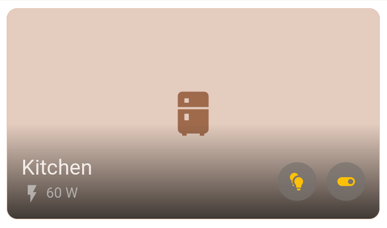
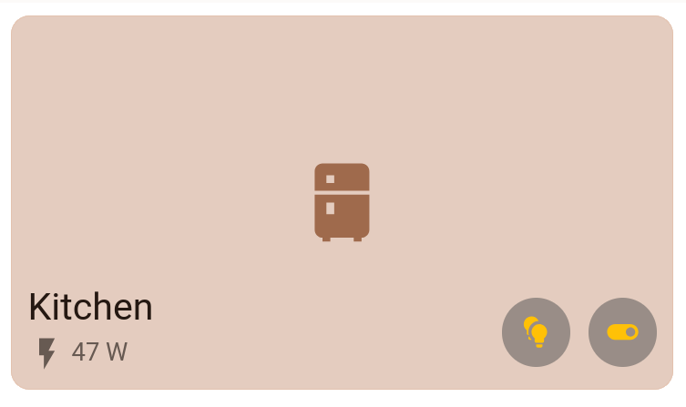

# HA-Simple-Theme
**A *"simple"* Home Assistant theme.**

## Examples
*Theme may have been tweaked since writing this README; your milage may vary.*

### Default
*Default color scheme:*
</br>

- **Primary Color:** `#c7845f` <span style="color: transparent; text-shadow: 0 0 0 #c7845f;">⬜</span>
- **Accent Color:** `#dec187` <span style="color: transparent; text-shadow: 0 0 0 #dec187;">⬜</span>


**Dark Mode**

**Light Mode**


### User Edited
*Example of a user edited color scheme*
</br>

- **Primary Color:** `#207336` <span style="color: transparent; text-shadow: 0 0 0 #207336;">⬜</span>
- **Accent Color:** `#f09b51` <span style="color: transparent; text-shadow: 0 0 0 #f09b51;">⬜</span>

**Dark Mode**

**Light Mode**


## Installation 
- Allow Home Assistant to read from the `themes` folder. Append the following to `configuration.yaml`: *(If not already)*
  ````yaml
  frontend:
    themes: !include_dir_merge_named themes
  ````
- Create the themes folder. *(if it doesn't exist)* Then git clone the repo, and extract theme YAML file.
  ```bash
  mkdir -p /config/themes && cd /config/themes
  git clone https://github.com/GeoDerp/HA-Simple-Theme.git
  mv /config/themes/HA-Simple-Theme/Simple.yaml /config/themes/Simple.yaml
  ```
- Press `c` on the Home Assistant web interface, then type and run `All YAML configuration` to read the updated YAML changes.
- Select the theme by selecting your profile image on the side bar, and selecting `simple` in the `Theme` section.
- For a different color variant, change the following hex colors in the `/config/themes/simple.yaml`:
  ```yaml
    primary-color: "#c7845f"  #Change
    accent-color: "#dec187"  #Change  
  ```   
  *Reset `All YAML Configuration` and refresh page, to apply any YAML file changes.*
  *As of writing, `primary-color` is used for the majority of the theme; `accent-color` being used to display some `on` states.*
- If you wish, you can also add the custom [lovelace-card-mod](https://github.com/thomasloven/lovelace-card-mod) css in this repository to their retrospective elements.  
  Example: `area-card-mod.yaml`
  ```yaml
  alert_classes:
    - motion
    - moisture
  sensor_classes:
    - temperature
    - humidity
    - power
  type: area
  area: kitchen
  navigation_path: /lovelace/kitchen
  show_camera: false
  card_mod:
    style: |
      .bottom {
      padding: 0 !important;
      margin: 10px !important;
      }
      ha-card:not(.image) .container::before {
          opacity: 0.05;
      }
      .container {
          background: #0000 !important;
      }
      .name, .sensor {
          color: var(--text) !important;
      }
      .name {
          max-width: min-content;
      }
      .buttons {
          min-width: fit-content
      }
  ```
  Before:  
  </br>
  After:  
  </br>

## Heavily inspired from/copied from:
A shutout to Mushroom Themes and catppuccin in which this theme is inspired and copies aspects from.

### piitaya / Mushroom Themes 

[lovelace-mushroom-themes](https://github.com/piitaya/lovelace-mushroom-themes)

### catppuccin / home-assistant

[catppuccin home assistant theme](https://github.com/catppuccin/home-assistant)

